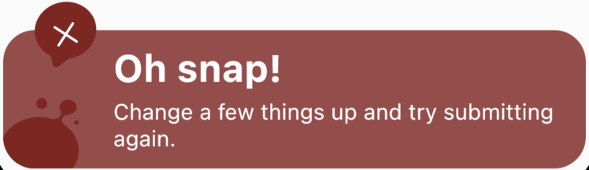
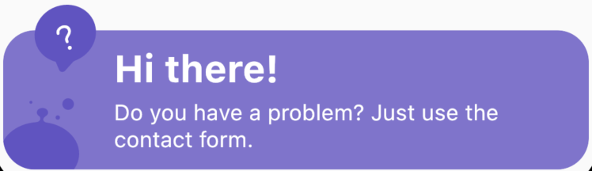
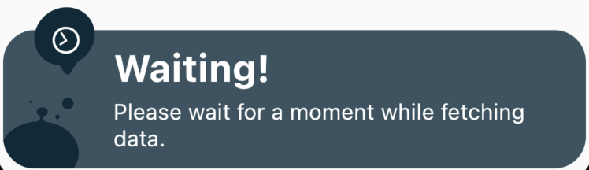
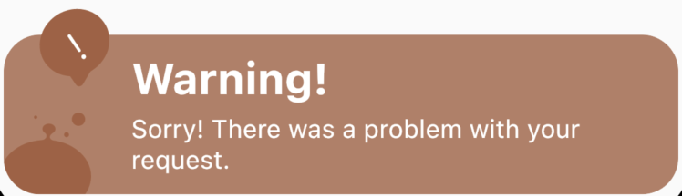

# Fancy Snackbar :dart:
```
Fancy Snackbar for notifications, 
alert messages, information messages,
waiting messages, warnings and success messages.
```

## Types

* SUCCESS


* ERROR



* INFO



* WAITING



* WARNING



## How to use

* import following dependencies in [pubspec.yaml](https://dart.dev/tools/pub/pubspec)
```yaml
fancy_snackbar:
    git:
      url: https://github.com/MR0100/fancy_snackbar.git
```

* explanations
```dart
/// FancySnackbar.showSnackbar() : it is the main method while will be used to render the snackbar.

/// there are some of the properties of the showSnackbar method.

/// context : context is the important property of snackbar to render on the display. 
/// context helps snackbar to find the screen where to render and where to take place in the widget tree.

/// snackBarType : this is the enumeration for the all available types of the snackbar.

/// Currently we are providing five types of snackbar.
/// 1. Success : FancySnackBarType.success
/// 2. Error : FancySnackBarType.error
/// 3. Info : FancySnackBarType.info
/// 4. Wating : FancySnackBarType.waiting
/// 5. Warning : FancySnackBarType.warning

/// title : it is the title of the snackbar.
/// message : it is the message of snackbar.

/// duration : it defines that how long you want to show the snackbar on the screen.
/// default duration is 3 seconds.
/// there you have to directly pass the duration.
/// 0.5 is calculated as 500 milliseconds. 
/// 1 is calculated as 1000 milliseconds = 1 second.

/// onCloseEvent : if you want to do some task when snackbar closes then you can write the code in this callback.

FancySnackbar.showSnackbar(
  context,
  snackBarType: FancySnackBarType.success,
  title: "Success Title",
  message: "Success Message",
  duration: 5,
  onCloseEvent: () {},
);
```


## Example

```dart
import 'package:fancy_snackbar/fancy_snackbar.dart';
import 'package:flutter/material.dart';

void main() {
  return runApp(const MySnackBar());
}

class MySnackBar extends StatelessWidget {
  const MySnackBar({Key? key}) : super(key: key);

  @override
  Widget build(BuildContext context) {
    return const MaterialApp(
      debugShowCheckedModeBanner: false,
      home: HomePage(),
    );
  }
}

class HomePage extends StatelessWidget {
  const HomePage({Key? key}) : super(key: key);

  @override
  Widget build(BuildContext context) {
    return Scaffold(
      body: Center(
        child: Column(
          mainAxisAlignment: MainAxisAlignment.center,
          children: ["success", "error", "waitting", "info", "warning"]
              .map((e) => GestureDetector(
                    onTap: () {
                      FancySnackbar.showSnackbar(
                        context,
                        snackBarType: FancySnackBarType.success,
                        title: "Success Title",
                        message: "Success Message",
                        duration: 5,
                        onCloseEvent: () {},
                      );
                    },
                    child: Container(
                      margin: const EdgeInsets.symmetric(vertical: 20),
                      padding: const EdgeInsets.symmetric(
                          horizontal: 20, vertical: 10),
                      color: Colors.blue,
                      child: Text(e),
                    ),
                  ))
              .toList(),
        ),
      ),
    );
  }
}


```
